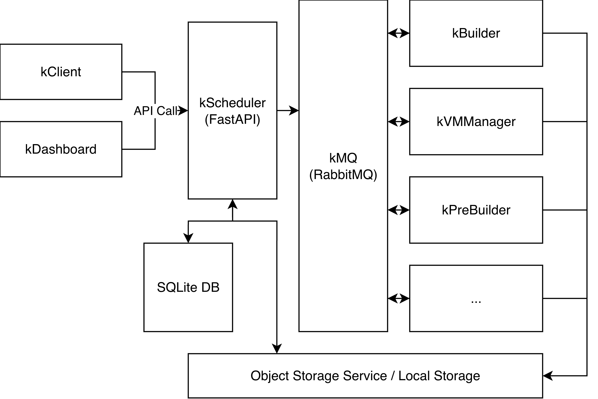

# 🏋️ kGymSuite

<a href="https://arxiv.org/abs/2504.20412"></a>

A distributed kernel build, test, and crash reproduction framework for Linux kernel research and security analysis.

### Other Related Folders
1. [Kernel Playground](https://github.com/Alex-Mathai-98/kGym-Kernel-Playground)
2. [kGym - For Only Google Cloud Platform](https://github.com/Alex-Mathai-98/kGym-Kernel-Gym)

## 📋 Overview



kGymSuite automates the process of building Linux kernels, applying patches, and reproducing kernel crashes in isolated VM environments. It provides a scalable microservices architecture that can handle multiple concurrent jobs across distributed workers.

**✨ Key Features:**
- **🔨 Automated Kernel Building**: Compile kernels from git commit with custom configs and patches
- **🐛 Crash Reproduction**: Run crash reproducers in isolated QEMU or GCE VMs using syzkaller
- **🚀 Distributed Execution**: Scale workers across multiple machines via RabbitMQ message queue
- **💾 Artifact Storage**: Flexible storage backends (local filesystem, GCS)
- **📊 Web Dashboard**: Monitor job status and view results in real-time
- **🐍 Python Client**: Programmatic job submission and control via REST API

## 🧩 Components

### ⚙️ Core Services

- **kscheduler**: FastAPI-based job scheduler managing job lifecycle and worker coordination
- **kmq**: RabbitMQ message broker for worker communication
- **kdashboard**: Next.js web interface for monitoring and management
- **kcore**: Shared Python library with worker base classes and storage backends

### 👷 Workers

- **kbuilder**: Compiles Linux kernels, applies patches, creates bootable VM images
- **kvmmanager**: Executes crash reproducers in QEMU or GCE VMs using syzkaller
- **kprebuilder**: Tests patch applicability on cached kernel builds

### 💻 Client

- **kclient**: Python library and CLI for job submission and API interaction

## 💡 Usage Examples

### 🖥️ Interactive Shell

Launch an IPython shell with kclient preloaded:

```bash
kclient
```

### 🏃 Run kBench bug

```python
from KBDr.kclient import SyzbotDataset, kBuilderArgument, kVMManagerArgument, kGymClient

ds = SyzbotDataset.from_hf('chenxi-kalorona-huang/kbench', 'kb')
bug = ds.root[0]
job = kJobRequest(
    jobWorkers=[
        kBuilderArgument.model_from_syzbot_data(bug),
        kVMManagerArgument.model_from_syzbot_data(bug)
    ],
    tags={}
)
client = kGymClient('https://kgym-api.example.com')
print(client.create_job(job))
```

### 🔧 Build Kernel with Patch

```python
job = kJobRequest(
    jobWorkers=[
        kBuilderArgument(
            kernelSource=KernelGitCommit('
                # see `kclient/repositories/populate.py` for common git URLs;
                gitUrl="https://git.kernel.org/pub/scm/linux/kernel/git/torvalds/linux.git",
                commitId="abc123def",
                # empty config results in defconfig;
                kConfig="",
                arch="amd64",
                compiler="gcc",
                linker="ld"
            ),
            userspaceImage="buildroot.raw",
            patch="diff --git a/kernel/foo.c ..."
        )
    ]
)
```

### 🧪 Build and Test with Reproducer

```python
from KBDr.kclient import kVMManagerArgument, Reproducer

job = kJobRequest(
    jobWorkers=[
        kBuilderArgument(...),  # Build kernel
        kVMManagerArgument(
            reproducer=Reproducer(
                reproducerType="c",
                reproducerText="/* C reproducer code */",
                syzkallerVersion="latest"
            ),
            image=0,  # Use output from first worker (kbuilder)
            machineType="qemu:2-4096"  # 2 CPUs, 4096MB RAM
        )
    ]
)
```

## ⚙️ Configuration

### 🏠 Local Development

Configuration files:
- `deployment/local/config.json`: System configuration (storage, workers, servers)
- `deployment/local/compose.yml`: Docker Compose service definitions
- `deployment/local/kgym-runner.env`: Environment variables (RabbitMQ connection)

### ☁️ Remote Deployment

For multi-server deployments on GCP or other cloud providers:

```bash
# Deploy to all configured servers
python kgym.py <deployment-name> new-deploy

# Configure Artifact Registry
python kgym.py <deployment-name> config-artifact-reg <GCP AR Server>

# Upgrade existing deployment
python kgym.py <deployment-name> upgrade

# Shutdown services
python kgym.py <deployment-name> down
```

See [DEPLOY.md](DEPLOY.md) for detailed deployment instructions.

## 💾 Storage Backends

kGymSuite supports multiple storage backends:

- **📁 Local Filesystem**: For development and single-machine deployments
- **☁️ Google Cloud Storage (GCS)**: For production GCP deployments

Configure via `storage.providerType` in `config.json`.

## 🛠️ Development

### 📁 Project Structure

```
kGymSuite/
--- kcore/           # Core worker framework and shared utilities
--- kscheduler/      # Job scheduler service
--- kbuilder/        # Kernel builder worker
--- kvmmanager/      # VM manager worker
--- kprebuilder/     # Patch pre-builder worker
--- kclient/         # Client library and CLI
--- kdashboard/      # Next.js web dashboard
--- deployment/      # Deployment configurations
-   --- local/       # Local development setup
-   --- gcp/         # GCP production setup
--- notebooks/       # Jupyter notebooks for evaluation
```

### 🧪 Running Tests

We have prepared notebooks at `notebooks/` for convenient evaluation.

```bash
docker compose -f ./deployment/local/compose.yml --project-directory . build

# Start services
docker compose -f ./deployment/local/compose.yml up -d kmq kscheduler kdashboard
docker compose -f ./deployment/local/compose.yml up -d kbuilder kvmmanager

# Run evaluation notebooks
jupyter notebook notebooks/
```

### 🔨 Building Individual Services

```bash
# Build specific service
docker compose -f ./deployment/local/compose.yml --project-directory . build kbuilder

# Restart after code changes
docker compose -f ./deployment/local/compose.yml restart kbuilder
```

## 📚 Documentation

- **[DEPLOY.md](DEPLOY.md)**: Comprehensive deployment guide for local and cloud environments
- **API Interface**: Available at `/docs` endpoint when scheduler is running

## 🔍 Troubleshooting

### ❌ Services won't start

```bash
# Check logs
docker compose -f ./deployment/local/compose.yml logs kscheduler

# Verify Docker daemon
sudo systemctl status docker
```

### 🚫 Workers not processing jobs

1. Check RabbitMQ connection in `deployment/<your deployment>/kgym-runner.env`
2. Verify kmq service is running: `docker ps | grep kmq`
3. Check worker logs for errors

### 🔒 Storage permission errors

```bash
# Fix permissions
sudo chown -R $USER:$USER /mnt/bucket
sudo chmod -R 755 /mnt/bucket
```

### ⚠️ KVM not available

```bash
# Check KVM module
lsmod | grep kvm

# Verify device access
ls -l /dev/kvm
```

## 🐞 Bug Reproducibility

It is the best to run kGymSuite on Google Cloud Platform, since majority of the Syzkaller fuzzing is done on GCP VMs. For local runs, we conducted a test run with local storage and QEMU, and 238 out of 279 kBenchSyz bugs were able to reproduce (`ninstance=5`). See [reproducible-bugs-on-qemu.json](./misc/reproducible-bugs-on-qemu.json) for the bug IDs reproduced by kGymSuite on QEMU.

## 📜 License

MIT

## 👥 Contributors

Chenxi Huang, Alex Mathai, Suwei Ma and Rohan Timmaraju

## 📖 Citation

**CrashFixer: A crash resolution agent for the Linux kernel**
```
@misc{mathai2025crashfixercrashresolutionagent,
      title={CrashFixer: A crash resolution agent for the Linux kernel}, 
      author={Alex Mathai and Chenxi Huang and Suwei Ma and Jihwan Kim and Hailie Mitchell and Aleksandr Nogikh and Petros Maniatis and Franjo Ivančić and Junfeng Yang and Baishakhi Ray},
      year={2025},
      eprint={2504.20412},
      archivePrefix={arXiv},
      primaryClass={cs.SE},
      url={https://arxiv.org/abs/2504.20412}, 
}
```

**KGym: A Platform and Dataset to Benchmark Large Language Models on Linux Kernel Crash Resolution**

```
@misc{mathai2024kgymplatformdatasetbenchmark,
      title={KGym: A Platform and Dataset to Benchmark Large Language Models on Linux Kernel Crash Resolution}, 
      author={Alex Mathai and Chenxi Huang and Petros Maniatis and Aleksandr Nogikh and Franjo Ivancic and Junfeng Yang and Baishakhi Ray},
      year={2024},
      eprint={2407.02680},
      archivePrefix={arXiv},
      primaryClass={cs.SE},
      url={https://arxiv.org/abs/2407.02680}, 
}
```

## 📧 Contact

Please open issues or email [Chenxi](mailto:chenxi@cs.columbia.edu) for kGymSuite questions.
